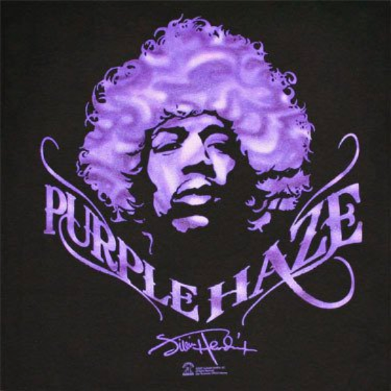

# Roguelike-game

Hello fellas! This is my own implementation of **"PURPLE HAZE"** game  in classic roguelike genre.

Imagine that you are legendary Jimi Hendrix and you are worried 
that there are a lot of haters and doubters around you. 
They criticize your music, your lifestyle, even your haircut. Screw this and let's blow off steam playing this game!

**Attention!** Reduce your volume level or put on headphones – you will be surprised to hear beautiful song.

## Game description
* Your goal is to kill all haters `H` and doubters `D`
* Basic movement: use `w`, `a`, `s`, `d` keys.
* Pick health packs `+` to restore your health

Good luck!

## Project structure
* [`Executor`](src/ru/itmo/sd/game/executor/Executor.java) class is responsible for loading map and running main 
  game window
* [`Game window`](src/ru/itmo/sd/game/ui/GameWindow.java) class draws UI and its components
* [`Runner`](src/ru/itmo/sd/game/executor/Runner.java) class manages actions on map: heroes' moves and medical kits 
  spawns
* [`Unit`](src/ru/itmo/sd/game/units/Unit.java) interface represents every object on a map
* [`Abstract mercenary`](src/ru/itmo/sd/game/mercenary/AbstractMerc.java) abstract class sets the rules of the units' 
  movement on a map
  
## Launching project instruction
Simply clone repository and run `./run.sh` script file from the root. Enjoy! 🔮
  

